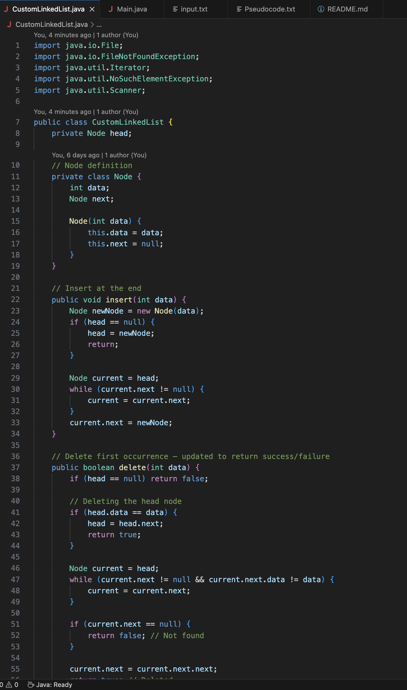
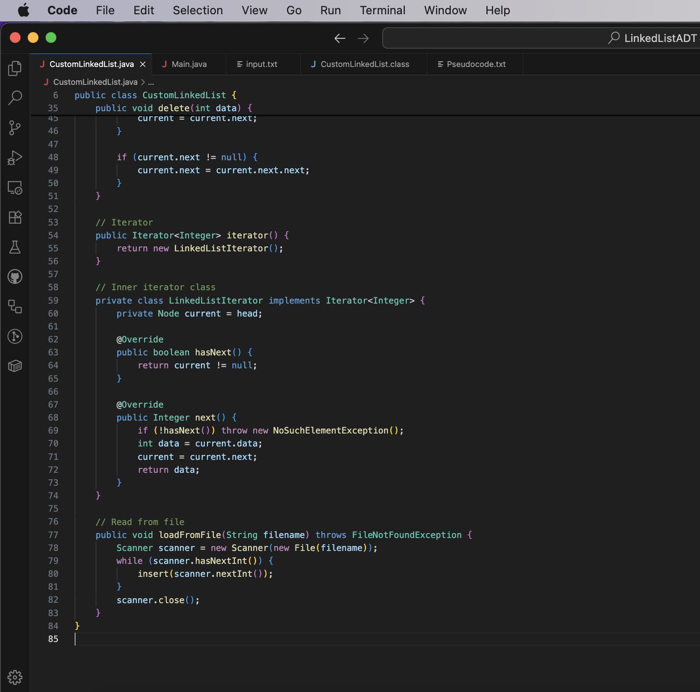
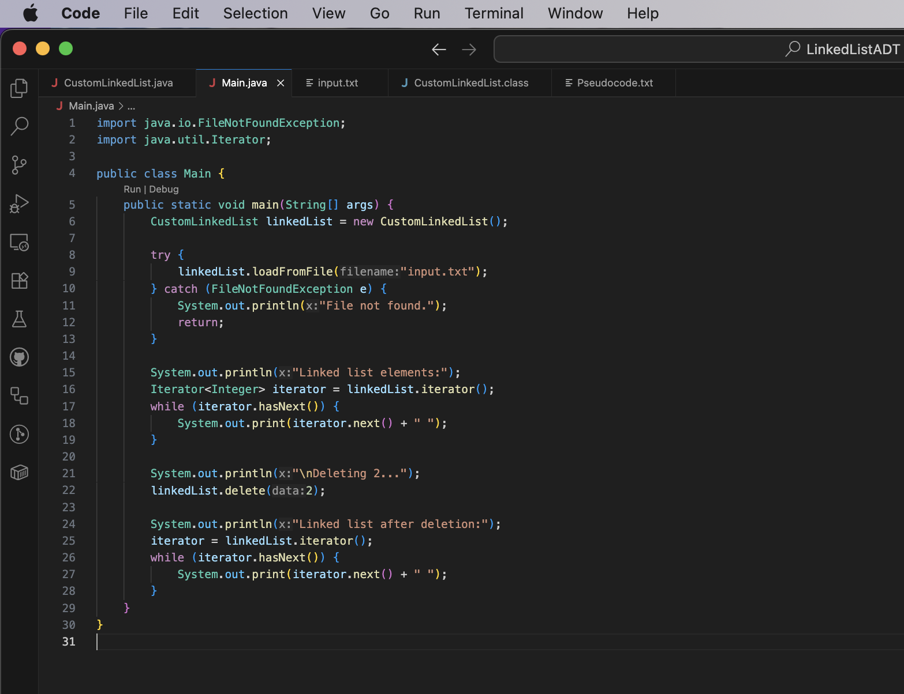
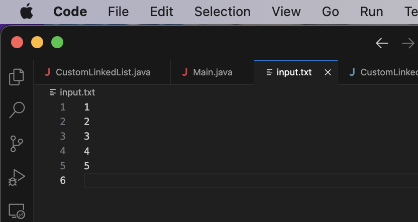
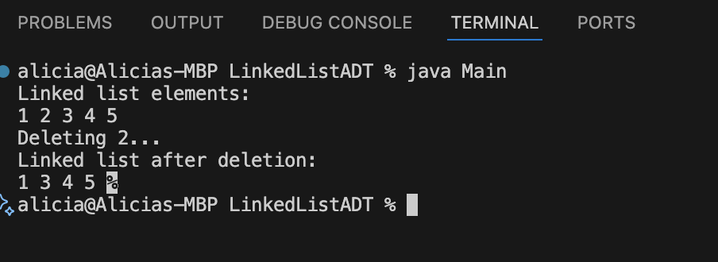
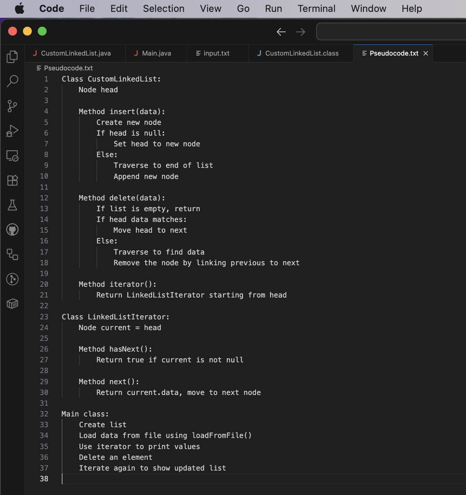

# Custom Linked List ADT in Java

This project was developed to strengthen my understanding of linked lists, abstract data types, nodes, and iterators in Java. It implements a custom singly linked list without using Java’s built-in `LinkedList` class.

The program loads integers from a text file, inserts them into the linked list, traverses the list with a custom iterator, deletes the first occurrence of a selected value, and displays the updated list.

## Features

- Implements a custom singly linked list from scratch
- Represents list elements with linked `Node` objects
- Inserts elements at the end of the list
- Deletes the first occurrence of a specified value
- Reports whether deletion was successful
- Loads integer values from a text file
- Traverses the list with a custom iterator
- Implements Java’s `Iterator<Integer>` interface
- Detects attempts to read beyond the iterator
- Handles missing input files
- Includes pseudocode describing the program logic

## Concepts Demonstrated

- Abstract data types (ADTs)
- Singly linked lists
- Nodes and references
- Dynamic data structures
- Encapsulation
- Inner classes
- Insertion
- Deletion
- Linked-list traversal
- Custom iterators
- The `Iterator` interface
- Generics
- Exception handling
- File input
- Scanner-based input processing
- Object-oriented programming

## Technologies Used

- Java
- Java Development Kit (JDK)
- Java Standard Library
- Visual Studio Code
- Git
- GitHub
- Terminal / Command Line

## Project Structure

```text
LinkedListADT/
├── Screenshots/
│   ├── CustomLinkedList.png
│   ├── CustomLinkedList2.png
│   ├── Input.png
│   ├── Main.png
│   ├── Output.png
│   └── Pseudocode.png
├── CustomLinkedList.java
├── Main.java
├── input.txt
├── Pseudocode.txt
├── README.md
└── .gitignore
```

- `CustomLinkedList.java` – Custom linked-list implementation
- `Main.java` – Program entry point and demonstration
- `input.txt` – Integer values loaded into the linked list
- `Pseudocode.txt` – Pseudocode describing the program logic
- `Screenshots/` – Source code, input, output, and pseudocode screenshots
- `.gitignore` – Excludes compiled Java files and editor settings
- `README.md` – Project documentation

## How to Run

### Prerequisites

- Java Development Kit (JDK 11 or later)
- Git
- A terminal or command-line environment

Verify that Java, the Java compiler, and Git are installed:

```bash
java -version
javac -version
git --version
```

### Steps

1. Clone the repository:

```bash
git clone https://github.com/aliramirez08/LinkedListADT.git
```

2. Navigate to the project directory:

```bash
cd LinkedListADT
```

3. Confirm that `input.txt` is in the project directory.

4. Compile the Java files:

```bash
javac CustomLinkedList.java Main.java
```

5. Run the program:

```bash
java Main
```

## Code Examples

### Node Definition

```java
private class Node {
    int data;
    Node next;

    Node(int data) {
        this.data = data;
        this.next = null;
    }
}
```

Each node stores an integer and a reference to the next node. The final node has a `next` reference of `null`.

### Inserting an Element

```java
public void insert(int data) {
    Node newNode = new Node(data);

    if (head == null) {
        head = newNode;
        return;
    }

    Node current = head;

    while (current.next != null) {
        current = current.next;
    }

    current.next = newNode;
}
```

If the list is empty, the new node becomes the head. Otherwise, the method traverses the list and attaches the new node to the end.

### Deleting an Element

```java
public boolean delete(int data) {
    if (head == null) {
        return false;
    }

    if (head.data == data) {
        head = head.next;
        return true;
    }

    Node current = head;

    while (current.next != null && current.next.data != data) {
        current = current.next;
    }

    if (current.next == null) {
        return false;
    }

    current.next = current.next.next;
    return true;
}
```

The method removes the first node containing the requested value. It returns `true` if an element was deleted and `false` if the value was not found.

### Custom Iterator

```java
private class LinkedListIterator implements Iterator<Integer> {
    private Node current = head;

    @Override
    public boolean hasNext() {
        return current != null;
    }

    @Override
    public Integer next() {
        if (!hasNext()) {
            throw new NoSuchElementException();
        }

        int data = current.data;
        current = current.next;
        return data;
    }
}
```

The iterator starts at the head and advances one node whenever `next()` is called. It throws `NoSuchElementException` when no elements remain.

### Loading Values from a File

```java
public void loadFromFile(String filename)
        throws FileNotFoundException {
    Scanner scanner = new Scanner(new File(filename));

    while (scanner.hasNextInt()) {
        insert(scanner.nextInt());
    }

    scanner.close();
}
```

The method reads integer values from the input file and inserts each one at the end of the linked list.

## Example Input

```text
1
2
3
4
5
```

## Example Output

```text
Linked list elements:
1 2 3 4 5

Deleting 2...
Element 2 deleted successfully.

Linked list after deletion:
1 3 4 5
```

The program removes the first occurrence of `2` while preserving the order of the remaining elements.

## What I Learned

This project strengthened my understanding of how linked lists work internally. I learned how nodes store data and references, how the head identifies the beginning of the list, and how traversal moves from one node to the next.

Implementing insertion and deletion helped me understand how references must be updated when the structure changes. I also learned how a custom iterator separates traversal behavior from the linked-list implementation and how Java’s `Iterator<Integer>` interface provides a standard traversal pattern.

Loading values from a file gave me additional practice with file handling, exception handling, and the `Scanner` class.

## Future Improvements

- Make the linked list generic instead of storing only integers
- Implement the `Iterable<Integer>` interface
- Add insertion at a specific index
- Add deletion by index
- Add `contains`, `get`, and `size` methods
- Add methods for clearing and reversing the list
- Track the tail node for faster insertion
- Use try-with-resources when reading files
- Validate and report non-integer file content
- Add automated unit tests
- Create a menu-driven interface
- Compare the custom implementation with Java’s built-in `LinkedList`

## Screenshots

### CustomLinkedList.java — Part 1



### CustomLinkedList.java — Part 2



### Main.java



### Input File



### Program Output



### Program Pseudocode


