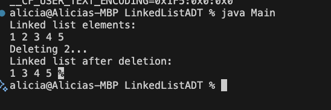

# Custom LinkedList ADT in Java

This project implements a **custom singly linked list (CustomLinkedList)** in Java that supports:

- Insertion of elements
- Deletion of the first occurrence of a value
- Traversal using a custom iterator
- Reading integer data from a text file (`input.txt`)

This is a basic Data Structures assignment intended to deepen understanding of how linked lists and iterators work at a low level.

---

## Features

- Custom singly linked list from scratch
- Inner class `LinkedListIterator` for traversal
- `insert(int data)` for appending elements
- `delete(int data)` to remove the first matching value
- `loadFromFile(String filename)` to populate the list from a file
- Java standard `Iterator` interface used for seamless traversal

---

## Sample Input

## Output

